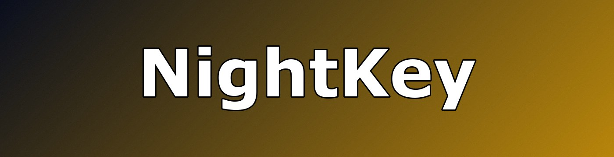

<p align="center">
  
</p>

<h1 align="center">NightKey ⌨ — macOS menu bar app to toggle MacBook keyboard backlight</h1>

<h3 align="center">Dead keys. Live glow. A single menu-bar click, or auto-off when a controller joins the room.</h3>

<p align="center">
  
  
  
  
  
</p>

<p align="center">
  <a href="#the-problem">Problem</a> ·
  <a href="#install">Install</a> ·
  <a href="#how-it-works">How it works</a> ·
  <a href="#features">Features</a> ·
  <a href="#troubleshooting">Troubleshooting</a> ·
  <a href="#design-notes">Design</a>
</p>

---

## The problem

Apple removed the dedicated keyboard-backlight keys (`F5` / `F6`) from newer MacBooks. The brightness is now either **auto-adaptive with no off state**, or stuck where the ambient light sensor put it — even in a pitch-dark room where the glow reflects off your face and you'd rather it just stop.

There's no preference pane for "toggle backlight off". The old `caffeinate`-era tricks for writing to `/sys` or `/dev` don't exist on macOS. AppleScript can't reach the HID subsystem. The private frameworks that used to expose the illumination key (`ISDHIDInterface`) have been deprecated or sandboxed off-limits.

| Approach | Works on M-series? | On/off toggle? | No root? |
|---|---|---|---|
| `F5` / `F6` | ✗ (keys removed) | — | — |
| System Settings → Keyboard brightness slider | ✓ | ✗ (dims but never 0) | ✓ |
| `pmset` / `sudo nvram` tweaks | ✗ | ✗ | ✗ |
| Private `ISDHIDInterface` framework | ✗ | ✓ | ✓ |
| **NightKey** | ✓ | ✓ | ✓ |

Turns out there's still one public API that the system honors: `NSEvent` with auxiliary subtype 8, posted with the legacy key codes `NX_KEYTYPE_ILLUMINATION_UP` / `_DOWN`. No private framework, no kernel extension, no sandbox opt-out. That's NightKey.

## Install

```bash
git clone https://github.com/Jok0ne/NightKey.git
cd NightKey
./build.sh                   # compiles the .app and drops it in /Applications
./install-launch-agent.sh    # registers ~/Library/LaunchAgents/io.zerone.nightkey.plist
```

After install, a small `⌨` icon appears in your menu bar. **Left-click** toggles the backlight off / on. **Right-click** opens a menu with auto-mode, quit, and about.

### Verify

```bash
# App bundle present
ls /Applications/NightKey.app

# LaunchAgent active
launchctl list | grep nightkey
# → <PID>  0  io.zerone.nightkey
```

### Uninstall

```bash
launchctl unload ~/Library/LaunchAgents/io.zerone.nightkey.plist
rm ~/Library/LaunchAgents/io.zerone.nightkey.plist
rm -rf /Applications/NightKey.app
```

## How it works

```text
  ┌───────────────────────────┐
  │   user clicks menu-bar ⌨  │
  └─────────────┬─────────────┘
                │
                ▼
  ┌───────────────────────────┐
  │   BacklightController     │
  │     .toggle()             │
  └─────────────┬─────────────┘
                │  posts NSEvent:
                │    type=systemDefined
                │    subtype=8
                │    data1=(keyCode<<16)|(keyState<<8)
                │    keyCode=NX_KEYTYPE_ILLUMINATION_UP|DOWN (21|22)
                ▼
  ┌───────────────────────────┐
  │   macOS WindowServer      │  dispatches to HID subsystem
  └─────────────┬─────────────┘
                │
                ▼
  ┌───────────────────────────┐
  │ Keyboard backlight PWM    │  steps one level up / down,
  │ driver                    │  system's own "backlight off"
  │                           │  threshold honored
  └───────────────────────────┘
```

Auto-mode adds a `GCControllerDidConnect` observer via `GameController` framework. When any HID-compliant game controller shows up (Xbox, PS5, Nintendo Pro, third-party MFi), it spams `ILLUMINATION_DOWN` until the backlight floor is reached. On `GCControllerDidDisconnect`, it restores.

## Features

- 🌙 **Click to toggle** — left-click the menu bar icon, backlight off / back on
- 🎮 **Auto mode** — connect a game controller, keyboard glow fades out; disconnect, it returns
- 🚀 **Auto-start** — installs as a user-level `LaunchAgent`, runs silently after every login
- 🪶 **Tiny** — ~200 lines of Swift, zero external dependencies, builds to a ~300 KB `.app`
- 🔒 **No private APIs, no kext** — uses only public `AppKit` + `GameController` + `NSEvent` subtype 8
- 🧹 **Reversible** — one-line uninstall, no `/sys` writes, no persistent state

## Project layout

```text
NightKey/
├── Package.swift                     # SwiftPM manifest
├── Sources/NightKey/
│   ├── main.swift                    # NSApplication entry
│   ├── AppDelegate.swift             # status bar item + menu + click handling
│   ├── BacklightController.swift     # posts the illumination NSEvents
│   └── GameControllerWatcher.swift   # GCController connect/disconnect
├── Resources/
│   ├── icon-1024.png                 # source icon (rendered via make-icon.swift)
│   └── NightKey.icns                 # multi-size app icon
├── make-icon.swift                   # draws the source PNG programmatically
├── make-iconset.sh                   # PNG → .iconset → .icns via iconutil
├── build.sh                          # release build → .app bundle → /Applications
└── install-launch-agent.sh           # registers the LaunchAgent plist
```

## Troubleshooting

<details>
<summary><b>Menu bar icon doesn't appear after install</b></summary>

<br>

The LaunchAgent may not have loaded yet. Force it:

```bash
launchctl unload ~/Library/LaunchAgents/io.zerone.nightkey.plist 2>/dev/null
launchctl load ~/Library/LaunchAgents/io.zerone.nightkey.plist
```

Check the agent is running:

```bash
launchctl list | grep nightkey
# Status column should be 0 (last exit code). If it shows 78 or non-zero,
# run the app directly once to see the error:
/Applications/NightKey.app/Contents/MacOS/NightKey
```

</details>

<details>
<summary><b>Backlight goes down a level but won't turn fully off</b></summary>

<br>

The backlight floor is controlled by the system — some MacBook models have a hardware-level minimum. NightKey presses `ILLUMINATION_DOWN` repeatedly until no further step occurs, which is the system's idea of "off". If your keyboard still glows faintly, that's the minimum the hardware allows.

Some external keyboards (Logitech MX, Keychron) have their own brightness state that `NSEvent` cannot reach — only the built-in MacBook keyboard responds.

</details>

<details>
<summary><b>Auto mode doesn't react when I plug in a controller</b></summary>

<br>

`GCController` needs the controller to be recognised by macOS first. Open System Settings → Game Controllers; the device should appear there within a second or two of connecting. If it doesn't, macOS doesn't see it as HID-compliant (e.g. some cheap no-name USB gamepads) and NightKey can't either.

Confirm NightKey is receiving the event:

```bash
log stream --predicate 'subsystem == "io.zerone.nightkey"' --level debug
# Connect the controller; you should see:
#   NightKey: controller connected — dimming
```

</details>

<details>
<summary><b>Intel Mac / macOS older than 14</b></summary>

<br>

NightKey's Swift concurrency (`@MainActor`) and some AppKit APIs require **macOS 14 (Sonoma) or later**. Apple Silicon is required because the `Package.swift` currently targets `arm64` only. An older Intel-Mac fork that drops the concurrency annotations would likely work, but isn't maintained upstream.

</details>

## Design notes

### Why `NSEvent` subtype 8 and not a private framework?

The public `NSEvent.type = .systemDefined` API with subtype 8 is how the system's own `F5`/`F6` keys deliver illumination requests internally. Since the subsystem that consumes them lives inside `WindowServer` and doesn't care *who* posted the event (only that it's a valid `systemDefined` with the right `data1` shape), a regular userland Swift process can post the same event and get the same effect. No entitlement, no code-signing exception.

Private frameworks like `ISDHIDInterface` or `IOHIDEventSystemClient` exist and are more powerful, but they break or get sandboxed on every other macOS release. NightKey traded power for longevity.

### Why a `LaunchAgent` and not `LSUIElement`-only + system login items?

Login items can be paused by the user in Settings, moved out of sequence, or fail silently after a major OS update. A user-level `LaunchAgent` with `RunAtLoad` and `KeepAlive=false` is the exact minimum needed — loads at login, exits only when the user quits it, and survives macOS updates cleanly because it lives under `~/Library/LaunchAgents/` (no `sudo`, no SIP interaction).

### Why `GCController` and not `IOHIDManager` / `IOKit`?

`IOHIDManager` would let us see every device class, not just game controllers. But on macOS 14+, accessing raw HID devices triggers a TCC permission prompt ("allow NightKey to monitor keyboard input") that's impossible to justify for a backlight toggle. `GCController` is the Apple-blessed path specifically for game controllers, no prompt required.

### What this does **not** touch

- **Display brightness** — separate subsystem, different event family (would be `NX_KEYTYPE_BRIGHTNESS_UP/DOWN`, deliberately out of scope)
- **Touch Bar** — doesn't have an illumination concept
- **External USB / Bluetooth keyboards** — those have their own backlight state NightKey can't reach
- **Dark Mode / appearance** — completely orthogonal

## License

MIT — see [LICENSE](LICENSE). Built by Zerone ⍟.

---

<sub>Header + badge palette: `#b8860b` amber / `#d4a017` light amber / `#0a0f1e` navy label — matched to the "keyboard glow at night" concept. Banner generated programmatically (PIL, matte gradient + noise + white-on-black-outline text).</sub>
